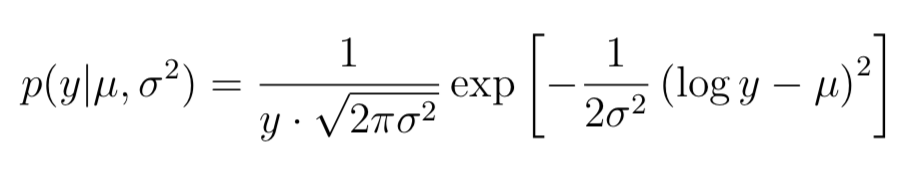
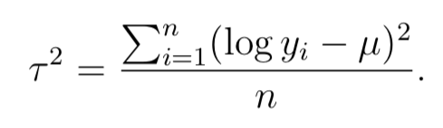
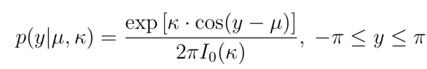

```{r setup, include=FALSE}
knitr::opts_chunk$set(echo = TRUE)
library(LaplacesDemon)
library(bayestestR)
library(dplyr)
library(plotly)
library(ggplot2)
```

## Exercise 1 -  Bernoulli ... again.
*Let y1, ..., yn|theta $\sim$ Bern(theta), and assume that you have obtained a sample with s = 5 successes in n = 20 trials. Assume a Beta(alpha0, beta0) prior for theta and let  alpha0 = beta0 = 2.*

*(a) Draw random numbers from the posterior theta|y $\sim$ Beta(alpha0 + s, beta0 + f ), y = (y1,...,yn), and verify graphically that the posterior mean and standard deviation converges to the true values as the number of random draws grows large.*

```{r}
# Data
n <- 20
s <- 5
f <- n - s

# Prior
alphaPrior <- 2
betaPrior <- 2

# Posterior
alphaPost <- s + alphaPrior
betaPost <- f + betaPrior

# Draws
randomDrawsBeta <- rbeta(20, alphaPost, betaPost)
drawMean <- mean(randomDrawsBeta)
drawSD <- sd(randomDrawsBeta)

# Expected mean and deviation
expectedMean <- alphaPost / (alphaPost + betaPost)
expectedSd <- ((alphaPost * betaPost) / ((alphaPost + betaPost)^2 * (alphaPost + betaPost + 1))) ^0.5

# Prepare vectors to visualize the convergence of the drawn mean and SD towards the true mean and SD. Also a sequence from 1 to 10 000 in intervals of 20 
drawMeanVect <- c()
drawSDVect <- c()
drawSeq <- seq(1, 10000, 20)

# Loop to try different number of draws 
for (i in drawSeq) {
  randomDrawsBeta <- rbeta(i, alphaPost, betaPost)
  drawMean <- mean(randomDrawsBeta)
  drawSD <- sd(randomDrawsBeta) 
  drawMeanVect <- append(drawMeanVect, drawMean)
  drawSDVect <- append(drawSDVect, drawSD)
}

plot(drawMeanVect,col="blue",main="Sample Mean vs Real",sub="Red: Sampled, Blue: Real",xlab="Number of draws",ylab="Mean")
abline(h=expectedMean,col="red")

plot(drawSDVect,col="blue",main="Sample Sdev vs Real",sub="Red: Sampled, Blue: Real",xlab="Number of draws",ylab="sdev")
abline(h=expectedSd,col="red")
```
*(b) Use simulation (nDraws = 10000) to compute the posterior probability Pr(theta > 0.3|y) and compare with the exact value [Hint: pbeta()].*
```{r}
n = 10000
randomDrawsBeta <- rbeta(n, alphaPost, betaPost)
drawAbove03 <- length(which(randomDrawsBeta > 0.3))
postProb <- drawAbove03/n
realProb <- pbeta(0.3, alphaPost, betaPost, lower.tail = FALSE)
```
*Compute the posterior distribution of the log-odds $\psi$ = log theta by simulation 1-theta (nDraws = 10000). [Hint: hist() and density() might come in handy]*
```{r}
randomDrawsBeta <- rbeta(n, alphaPost, betaPost)
logDraws <- log(randomDrawsBeta/(1-randomDrawsBeta))
hist(logDraws, breaks = 50)
density(logDraws)
```

## Exercise 2 - Log-normal distribution and the Gini coefficient
**(a)** *Assume that you have asked 10 randomly selected persons about their monthly in- come (in thousands Swedish Krona) and obtained the following ten observations: 44, 25, 45, 52, 30, 63, 19, 50, 34 and 67. A common model for non-negative continuous variables is the log-normal distribution. The log-normal distribution logN(mu,sigma2) has density function*
```{r, echo=FALSE, out.width="60%"}

```
*for y > 0, mu > 0 and sigma2 > 0. The log-normal distribution is related to the normal distribution as follows: if y $\sim$ log N (mu, sigma2) then log y $\sim$ N (mu, sigma2). Let y1,...,yn|mu,sigma $\sim$ logN(mu,sigma ), where mu = 3.7 is assumed to be known but sigma is unknown with non-informative prior p(sigma2) prop_to 1/sigma2. The posterior for sigma2 is the Inv-chi2(n,tau2) distribution, where*
```{r, echo=FALSE, out.width="40%"}

```
```{r}
nDraws <- 10000
data <- c(14, 25, 45, 25, 30, 33, 19, 50, 34, 67)
n <- length(data)
mu <- 3.7
tauSquared <- sum((log(data) - mu)^2)/n

# Posterior draws
xDraws <- rchisq(nDraws, n-1)
sigma2Draws <- ((n-1)*tauSquared)/xDraws

# Theoretical inverse chi squared distribution
theoreticalScaledInv <- (((tauSquared*(n/2))^(n/2))/gamma(n/2))*(exp(-n*tauSquared/(seq(0, 2, 0.05)*2)))/((seq(0, 2, 0.05)^(1+(n/2))))

# Plotting the density of the cdf values
hist(sigma2Draws, probability = TRUE, breaks = 100 )
lines(seq(0, 2, 0.05) ,theoreticalScaledInv, col="red")
```
The graph shows that the Gini index is around 0.2 - 0.4 which states relatively equal. The Large coverage in the graph is due top a large variance which is due to a small data set

**(b)** *The most common measure of income inequality is the Gini coefficient, G, where 0 <= G <= 1. G = 0 means a completely equal income distribution, whereas G = 1 means complete income inequality. See Wikipedia for more information. It can be shown that G = 2phi(sigma/sqrt2) - 1 when incomes follow a log N (mu, sigma2) distribution. phi(z) is the cumulative distribution function (CDF) for the standard normal distribution with mean zero and unit variance. Use the posterior draws in a) to compute the posterior distribution of the Gini coefficient G for the current data set.*
```{r}
G <- 2*pnorm(sqrt(sigma2Draws/2), mean = 0, sd = 1) - 1
hist(G, probability = TRUE, breaks = 100, xlim = c(0.1, 0.7))
lines(density(G), col = "red")
```
**(c)**  *Use the posterior draws from b) to compute a 90% equal tail credible interval for G. A 90% equal tail interval (a,b) cuts off 5% percent of the posterior probability mass to the left of a, and 5% to the right of b. Also, do a kernel density estimate of the posterior of G using the density function in R with default settings, and use that kernel density estimate to compute a 90% Highest Posterior Density interval for G. Compare the two intervals.*
```{r}
# Calculating the credible interval, standard on 90% equal tail
credibleInterval <- p.interval(obj = G, prob = 0.95, HPD = FALSE)

# Adding the credible interval to the graph
hist(G, probability = TRUE, breaks = 100, xlim = c(0.1, 0.7))
lines(density(G), col = "red")
abline(v = credibleInterval, col = "blue", lwd = 2, lty = 2)

# Computing the highest posterior density
HPDInterval <- p.interval(G, prob = 0.95)

# Adding the HPD interval to the graph
abline(v = HPDInterval, col = "green", lwd = 2, lty = 2)

# OBS! Alternative way to compute HPD for G, the way they ask for in the lab
densityG <- density(G)
densityG
sortedDensityG <- sort(densityG$y, decreasing = TRUE)
densityStamp <- 0
count <- 0
while (densityStamp < 0.95) {
  count <- count + 1
  densityStamp <- sum(sortedDensityG[1:count])/sum(sortedDensityG)
}

densityLimit <- sortedDensityG[count]
densityLimit95 <- which(densityG$y >= densityLimit)
limits <- c(densityG$x[densityLimit95[1]], densityG$x[densityLimit95[length(densityLimit95)]])

HPDInterval
limits
```
## Exercise 3 - Bayesian inference for the concentration parameter in the von Mises distribution.
*This exercise is concerned with directional data. The point is to show you that the posterior distribution for somewhat weird models can be obtained by plotting it over a grid of values. The data points are observed wind directions at a given location on ten different days. The data are recorded in degrees:*
(40, 303, 326, 285, 296, 314, 20, 308, 299, 296)
*where North is located at zero degrees (see Figure 1 on the next page, where the angles are measured clockwise). To fit with Wikipedias description of probability distributions for circular data we convert the data into radians -pi <= y <= pi . The 10 observations in radians are:*
(-2.44, 2.14, 2.54, 1.83, 2.02, 2.33, -2.79, 2.23, 2.07, 2.02)
*Assume that these data points are independent observations following the von Mises distribution:*
```{r, echo=FALSE, out.width="40%"}

```
*where I0(kapa) is the modified Bessel function of the first kind of order zero [see ?besselI in R]. The parameter mu (-pi <= mu <= pi) is the mean direction and kapa > 0 is called the concentration parameter. Large kapa gives a small variance around mu, and vice versa. Assume that mu is known to be 2.39. Let kapa $\sim$ Exponential(lambda = 1) a priori, where lambda is the rate parameter of the exponential distribution (so that the mean is 1/lambda).*

**(a)** *Plot the posterior distribution of kapa for the wind direction data over a fine grid of kapa values.*
```{r}
vonMiseLikelihood <- function(k, y, mu){
  #Multiply with dexp(k) to take into account the prior of kapa 
  return ( prod(exp(k*cos(y-mu))/(2*pi*besselI(k,0)))*dexp(k) ) 
} 

data <-c(-2.44,2.14,2.54,1.83,2.02,2.33,-2.79,2.23, 2.07,2.02)
mu <- 2.39

# Creates a fine grid of Kapa values
kapa <- seq(0,10,0.001)
posteriorsKapa <- numeric()

# Compute the posteriors for each kapa value
for ( i in 1:length(kapa)){
  posteriorsKapa[i] <- vonMiseLikelihood(kapa[i], data, mu)
}
posteriorsKapa <- posteriorsKapa/sum(posteriorsKapa)
plot(x=kapa,y=posteriorsKapa)
```
**(b)** *Find the (approximate) posterior mode of kapa from the information in a).*
```{r}
apprPostMode <- kapa[which.max(posteriorsKapa)]
apprPostMode
```
